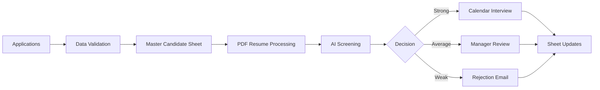

# Multi-Role Hiring Automation System

> A complete AI-powered recruitment workflow built with n8n, Google Workspace, and role-specific screening logic.


---

## Overview

This project automates a multi-role hiring pipeline for **Software Engineer (SWE)** and **Business Development Manager (BDM)** candidates.

The workflow reads applications from Google Sheets, validates candidate data, processes PDF resumes, screens candidates with AI, stores results in a master database, and automatically handles interview scheduling or email communication.

It is designed to reduce manual hiring effort while keeping the process structured, trackable, and professional.

---

## What This Workflow Does

- Reads SWE and BDM applications from separate Google Sheets
- Cleans and validates candidate information
- Accepts PDF resumes through Google Drive links
- Generates a unique Candidate ID for every valid candidate
- Prevents duplicate candidate processing
- Stores all candidate records in a master Google Sheet
- Uses AI to classify candidates as strong, average, or weak
- Schedules interviews for strong candidates
- Sends hiring manager review emails for average candidates
- Sends polite rejection emails for weak candidates
- Updates source and master sheets after each action

---

## Workflow Journey



---

## Candidate Outcomes

| Candidate Type | Automated Action |
| :--- | :--- |
| Strong | Interview is scheduled and confirmation email is sent |
| Average | Hiring manager receives a manual review email |
| Weak | Candidate receives a professional rejection email |

---

## Main Code Nodes

The workflow uses a few Code nodes for custom logic:

| Code Node | Purpose |
| :--- | :--- |
| Validate & Deduplicate Candidates | Cleans incoming rows, validates required fields, extracts Drive file IDs, generates Candidate IDs, and skips duplicates |
| Format Stop Reason | Returns a clear stop message when no valid new candidates are found |
| Parse AI Screening Result | Cleans and validates AI output, forces score-based classification, and prepares sheet updates |
| Build Interview Email | Builds the interview confirmation email from the calendar event and candidate data |

Python is used for heavier data logic such as validation, deduplication, hashing, and AI JSON parsing. JavaScript is used for smaller n8n-specific tasks such as reading node outputs, formatting calendar data, and building email payloads.

---

## Workflow Status Values

The `workflow_status` field tracks the current workflow stage or result.

| Value | Meaning |
| :--- | :--- |
| `NEW` | Candidate passed validation and can move forward |
| `NO_NEW_CANDIDATES` | No valid new candidates were found |
| `SCREENED` | AI screening completed successfully |
| `ERROR` | AI screening failed or returned invalid output |

`workflow_status` is different from `status`. `workflow_status` describes the workflow stage, while `status` describes the candidate's saved hiring state, such as `pending`, `screened`, `screening_error`, `interview_scheduled`, `manual_review_notified`, or `rejected`.

---

## Interview Scheduling

Strong candidates are scheduled automatically using a realistic interview window:

- **Time:** 2:00 PM to 4:00 PM
- **Timezone:** Asia/Karachi
- **Days:** Monday to Friday only
- **Limit:** 4 interviews per day
- **Slot length:** 30 minutes

Calendar invites are sent by adding the candidate as an attendee and enabling calendar update notifications.

---

## Key Safeguards

- Required candidate fields are checked before processing
- Resume must be a valid PDF
- Duplicate candidates are avoided using email and role
- Failed retryable records can be processed again
- AI output is validated before updating sheets
- Weekend interview scheduling is skipped
- Timezone is fixed to avoid incorrect interview times

---

## Tech Stack

| Layer | Tools |
| :--- | :--- |
| Automation | n8n |
| Database | Google Sheets |
| Resume Storage | Google Drive |
| Communication | Gmail |
| Scheduling | Google Calendar |
| Intelligence | AI resume screening |
| Logic | Python and JavaScript inside n8n |
| Runtime | Docker |

---

## Project Structure

```text
workflows/   n8n workflow JSON files
docs/        walkthrough and workflow documentation
assets/      screenshots and demo assets
data/        local n8n runtime data
```

---

## Quick Start

1. Create Google Sheets for:
   - SWE Applications
   - BDM Applications
   - Master Candidates

2. Import the workflow into n8n:

```text
workflows/21Afnan_HiringAutomation_template.json
```

3. Connect credentials for:
   - Google Sheets
   - Google Drive
   - Gmail
   - Google Calendar
   - AI provider

4. Start n8n:

```bash
docker compose up -d
```

5. Open n8n and activate the workflow.

---

## Documentation

Detailed walkthrough script:

```text
docs/Workflow_Walkthrough_Script.md
```

---

## Author

**Afnan Shoukat**  
*n8n Automation Expert | AI Integrations Specialist*

[](https://github.com/21Afnan)
[](https://www.linkedin.com/in/afnanshoukat)

---

## Security Note

Production credentials, OAuth tokens, and private API keys should never be committed to this repository.
