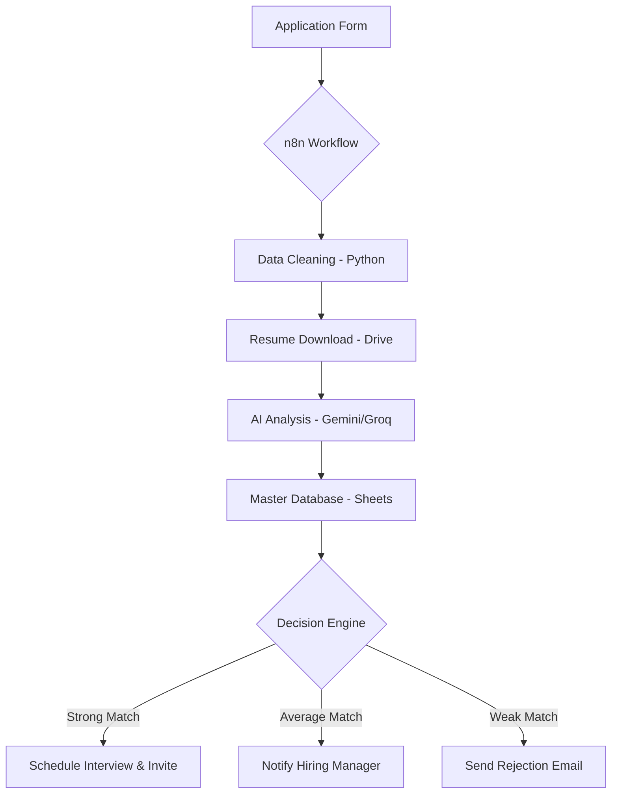

# 🤖 Multi-Role Hiring Automation System

> **Transforming recruitment from a manual chore into a seamless AI-driven pipeline.**

An enterprise-grade automation solution built with **n8n** that scales hiring by performing role-specific AI screening, managing a central candidate database, and automating all stakeholder communications.

---

## ✨ Features at a Glance

| Feature | Description |
| :--- | :--- |
| **Multi-Role Ingestion** | Handles parallel streams for Software Engineers & BDMs. |
| **Smart Scraping** | Python-powered cleaning to standardize messy form data. |
| **Intelligent ID** | Hash-based deduplication ensures no candidate is processed twice. |
| **Context-Aware AI** | Specialized rubrics score tech skills for SWEs and sales metrics for BDMs. |
| **Full Lifecycle** | From initial sheet entry to Google Calendar interview booking. |

---

## 🛠️ Tech Architecture

### The Stack
- **Engine**: [n8n](https://n8n.io/)
- **Intelligence**: Google Gemini / Llama 3 (via Groq)
- **Database**: Google Sheets
- **Communication**: Gmail & Google Calendar
- **Logic**: Python 3.x

---

## 🚀 Quick Start

### 1. Database Setup
Create three Google Sheets:
1.  **SWE Applications**
2.  **BDM Applications**
3.  **Master Candidates** (Single source of truth)

### 2. Configure n8n
1.  Import [workflows/AfnanShoukat_HiringAutomation_template.json](workflows/AfnanShoukat_HiringAutomation_template.json).
2.  Connect your Google Workspace & AI Provider credentials.
3.  Replace placeholder IDs (e.g., `YOUR_SWE_FORM_RESPONSES_SHEET_ID`) with your own.

---

## 📂 Project Structure

- `workflows/` - Sanitized n8n JSON templates.
- `docs/` - Detailed logic walkthroughs and technical fixes.
- `assets/` - Screenshots and demo videos of the system in action.
- `data/` - (Ignored) Local execution logs and sensitive state.

---

## 👨‍💻 Developed By

**Afnan Shoukat**  
*n8n Automation Expert | AI Integrations Specialist*

---
*Note: This repository excludes all private credentials and production keys for security.*

