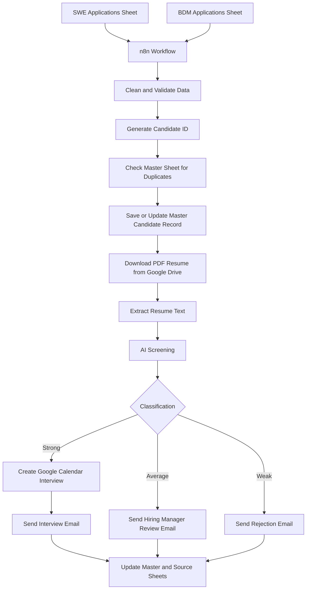

# Multi-Role Hiring Automation System

An n8n automation workflow that manages a complete hiring pipeline for multiple roles. It reads applications from Google Sheets, cleans candidate data, prevents duplicates, extracts PDF resume text, screens candidates with AI, updates a master candidate database, and sends the correct follow-up through Gmail and Google Calendar.

## Supported Roles

- SWE: Software Engineer
- BDM: Business Development Manager

Both roles are processed in one workflow, but the AI screening rubric is role-specific.

## Main Features

| Feature | Description |
| :--- | :--- |
| Multi-role intake | Reads SWE and BDM applications from separate Google Sheets. |
| Required field validation | Treats important fields as compulsory before processing. |
| PDF resume handling | Assumes resumes are uploaded as PDF files only. |
| Candidate ID generation | Creates stable IDs using role plus a hash of email and role. |
| Duplicate prevention | Avoids reprocessing the same candidate for the same role. |
| Master database | Stores all valid candidates in one master Google Sheet. |
| AI screening | Scores candidates using role-specific criteria. |
| Decision routing | Sends strong, average, and weak candidates down different paths. |
| Calendar scheduling | Schedules strong candidates between 2 PM and 4 PM Pakistan time. |
| Calendar invites | Adds candidate as attendee and sends Google Calendar invite updates. |
| Email automation | Sends interview, manual review, or rejection emails. |

## Workflow Architecture



## Key Assumptions

- Candidate name is required.
- Candidate email is required.
- Role-specific details are required.
- Resume link is required.
- Resume must be a PDF.
- Resume must be available through a valid Google Drive link.
- Non-PDF, missing, unreadable, or invalid resumes should not move forward automatically.

These assumptions keep the automation reliable because AI screening depends on clean candidate data and readable resume text.

## Candidate ID Logic

Each candidate receives a stable Candidate ID.

The ID is generated from:

```text
candidate email + role
```

The workflow lowercases the email, uppercases the role, creates a SHA-256 hash, and uses the first 12 characters.

Example format:

```text
SWE-7A9F2C31B8D4
BDM-91AC8F20E112
```

This means the same candidate applying for the same role produces the same Candidate ID.

## Duplicate Prevention Logic

Duplicates are checked using:

```text
email + role
```

Example:

```text
alex@example.com|SWE
```

If the same email and role already exist in the master sheet with a final status, the workflow skips that candidate.

The workflow also checks duplicates within the same run, so duplicate rows in the source sheet do not create duplicate emails or calendar events.

Retryable statuses are allowed to run again:

```text
pending
screening_error
resume_error
```

This allows failed candidates to be retried without allowing duplicate final processing.

## Data Cleaning Logic

The workflow cleans raw form data before screening.

It removes invalid empty values such as:

```text
empty string
nan
none
-
n/a
null
```

It also trims extra spaces and searches for fields using exact names and fallback keywords.

For SWE candidates, it extracts:

- name
- email
- resume or CV
- programming languages or skills
- GitHub or portfolio link

For BDM candidates, it extracts:

- name
- contact email
- resume
- sales experience
- LinkedIn profile

## AI Screening Logic

The AI is instructed to be strict, fair, and evidence-based.

It only uses:

- resume text
- candidate metadata
- role information

It does not browse, invent facts, or assume missing experience.

The AI returns:

- score
- classification
- summary
- key strengths
- concerns
- interview recommendation

Score bands:

```text
75-100 = strong
50-74  = average
0-49   = weak
```

The workflow enforces these score bands after the AI response. If the AI score and classification do not match, the workflow corrects the classification based on the score.

## Role-Specific Screening

SWE candidates are evaluated on:

- production software experience
- programming languages
- frontend/backend/API/database work
- system design
- cloud or DevOps
- testing and debugging
- GitHub, portfolio, or project evidence
- measurable impact

BDM candidates are evaluated on:

- sales experience
- revenue or quota ownership
- target achievement
- lead generation
- pipeline management
- client handling
- negotiation
- CRM usage
- account growth

## Decision Logic

After screening, candidates are routed by `ai_classification`.

```text
strong  -> schedule interview and send interview email
average -> send manual review email to hiring manager
weak    -> send rejection email
```

## Interview Scheduling Logic

Only strong candidates are scheduled automatically.

Interview window:

```text
2:00 PM to 4:00 PM Asia/Karachi time
```

Available slots:

```text
2:00 PM - 2:30 PM
2:30 PM - 3:00 PM
3:00 PM - 3:30 PM
3:30 PM - 4:00 PM
```

Rules:

- Maximum 4 interviews per day.
- Interviews are scheduled Monday to Friday only.
- Weekends are skipped.
- If more than 4 strong candidates are found, remaining candidates move to the next business day.

Example for 10 strong candidates:

```text
Day 1: 4 interviews
Day 2: 4 interviews
Day 3: 2 interviews
```

The workflow uses `Asia/Karachi` timezone to avoid server timezone conversion issues.

## Calendar Invite Logic

For strong candidates, the workflow creates a Google Calendar event.

The candidate email is added as an attendee.

The workflow also sets:

```text
sendUpdates = all
```

This tells Google Calendar to send the invite notification to the attendee.

## Email Logic

The workflow sends different emails based on candidate classification.

Strong candidates receive an interview confirmation email.

Average candidates trigger a hiring manager review email.

Weak candidates receive a polite rejection email.

The Gmail interview email body is built by the previous workflow step and sent using:

```text
{{ $json.output.email_body }}
```

The recipient is:

```text
{{ $json.output.candidate_email }}
```

## Sheet Updates

After communication is completed, the workflow updates both the source sheet and the master sheet.

Strong candidates:

```text
contacted = YES
status = interview_scheduled
calendar_event_link = saved
```

Average candidates:

```text
contacted = YES
status = manual_review_notified
```

Weak candidates:

```text
contacted = YES
status = rejected
```

The source row is also marked as processed so it is not picked again in future runs.

## Protection and Reliability

The workflow includes safeguards for:

- missing required fields
- invalid or non-PDF resumes
- broken Google Drive resume links
- duplicate candidates
- duplicate rows in the same run
- retryable failed statuses
- invalid AI JSON output
- mismatched AI score and classification
- weekend interview scheduling
- timezone conversion issues
- missing calendar invite notifications

## Tech Stack

- n8n
- Google Sheets
- Google Drive
- Gmail
- Google Calendar
- AI screening model
- Python logic inside n8n code nodes
- JavaScript expressions inside n8n nodes

## Quick Start

1. Create the required Google Sheets:
   - SWE Applications
   - BDM Applications
   - Master Candidates

2. Import the workflow:
   - `workflows/21Afnan_HiringAutomation_template.json`

3. Connect credentials:
   - Google Sheets
   - Google Drive
   - Gmail
   - Google Calendar
   - AI provider

4. Replace placeholder IDs in the template with your own sheet IDs, calendar ID, and credential IDs.

5. Start n8n with Docker:

```bash
docker compose up -d
```

The included Docker Compose file sets:

```text
GENERIC_TIMEZONE=Asia/Karachi
TZ=Asia/Karachi
```

## Project Structure

```text
workflows/  n8n workflow JSON files
docs/       walkthroughs and technical documentation
assets/     screenshots and demo assets
data/       local n8n runtime data, ignored by git
```

## Documentation

Detailed walkthrough:

```text
docs/Workflow_Walkthrough_Script.md
```

## Developed By

Afnan Shoukat

n8n Automation Expert | AI Integrations Specialist

- GitHub: https://github.com/21Afnan
- LinkedIn: https://www.linkedin.com/in/afnanshoukat

## Security Note

This repository should not include production credentials, private tokens, or OAuth secrets.

